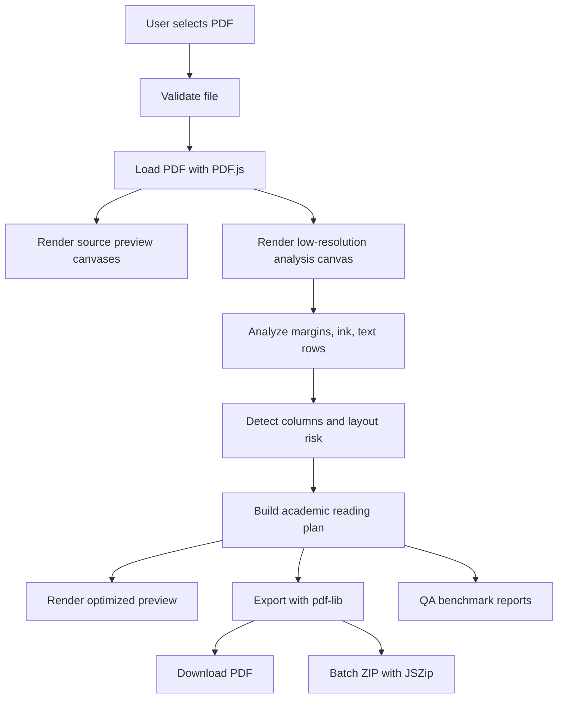

# Architecture

ComfyPaper is a local-first browser prototype built with Next.js, React, TypeScript, PDF.js, pdf-lib, and JSZip. The architecture separates PDF rendering and analysis from PDF export so previews can be rasterized quickly while final output can preserve vector content where possible.

## Data Flow

## Key Modules

| Area | Modules |
| --- | --- |
| Validation | `lib/validation/pdfValidation.ts` |
| PDF loading | `lib/pdf/loadPdf.ts` |
| Source preview | `lib/pdf/renderPages.ts` |
| Reading preview | `lib/pdf/renderReadingPreviews.ts` |
| Margin and crop analysis | `lib/pdf/cropDetection.ts`, `lib/pdf/analyzePageMargins.ts` |
| Column and text analysis | `lib/pdf/columnDetection.ts`, `lib/pdf/textLineModel.ts` |
| Reading plans | `lib/pdf/academicReadingPlan.ts`, `lib/pdf/readingTiles.ts`, `lib/pdf/readingProfiles.ts` |
| Coordinate mapping | `lib/pdf/normalizedRects.ts`, `lib/pdf/pdfCoordinateMapping.ts` |
| Export | `lib/pdf/exportColumnReadingPdf.ts`, `lib/pdf/exportCroppedPdf.ts`, `lib/product/exportWorkflow.ts` |
| Batch export | `lib/product/batchExport.ts` |
| Reports | `lib/product/optimizationReport.ts`, `components/OptimizationReport.tsx`, `components/PageSafetyReport.tsx` |
| Benchmark | `scripts/qa-real-papers.mjs`, `scripts/build-validation-report.mjs` |

## Rendering And Analysis Pipeline

1. The app loads the selected file with PDF.js in the browser.
2. Original preview pages are rendered to canvas with a capped device pixel ratio.
3. A lower-resolution analysis canvas is rendered for layout detection.
4. Pixel data is used for ink and margin analysis.
5. PDF.js text content is grouped into text rows.
6. The column detector combines ink, text rows, preset rules, and safety checks.
7. The academic planner creates output-page plans or preserves risky pages.
8. The preview renderer crops source canvas regions into proposed reading pages.

## Export Pipeline

The export path uses pdf-lib rather than exporting preview images:

- Margin-only pages can be copied and assigned a PDF CropBox.
- Column-reading pages embed source page regions into new pages sized for the selected reading profile.
- Preserved pages are copied through when the planner cannot safely transform them.

This design keeps output closer to the original PDF content, but it makes coordinate mapping and crop validation critical.

## Batch Flow

Batch export is implemented in `lib/product/batchExport.ts`.

1. Files are queued.
2. Each file runs through the single-PDF export workflow.
3. Completed outputs are added to a JSZip archive.
4. Failed files are recorded without stopping the entire batch.
5. A human-readable summary is included in the ZIP.

## Benchmark Flow

The real-paper benchmark reads local PDFs from `qa/pdfs-local/`, drives the browser app with Playwright, executes QA hooks for each preset, samples distributed pages, and writes JSON/Markdown reports into `qa/real-paper-reports/`.

Those folders are gitignored because they can contain private PDFs and generated artifacts.
